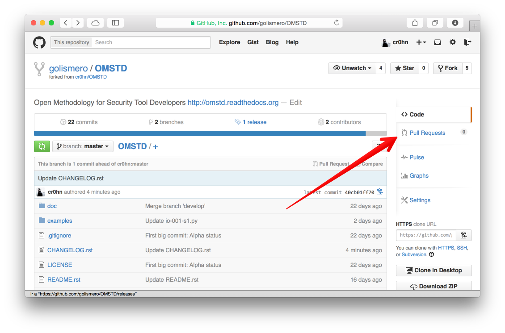
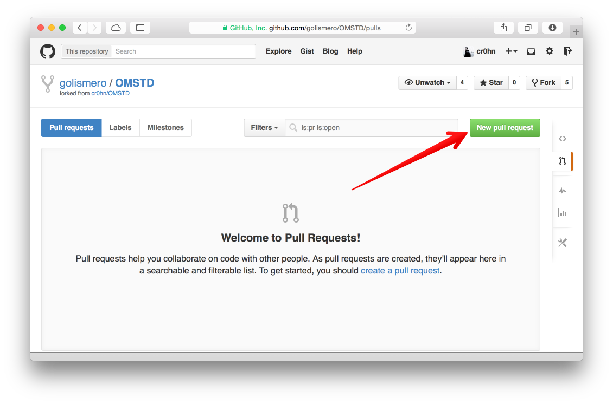
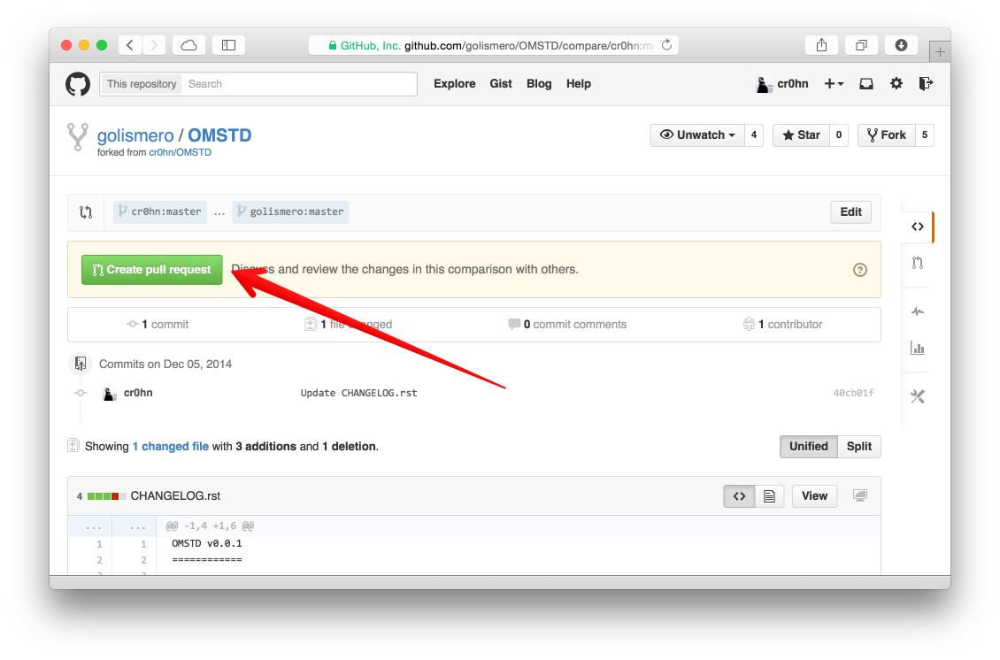
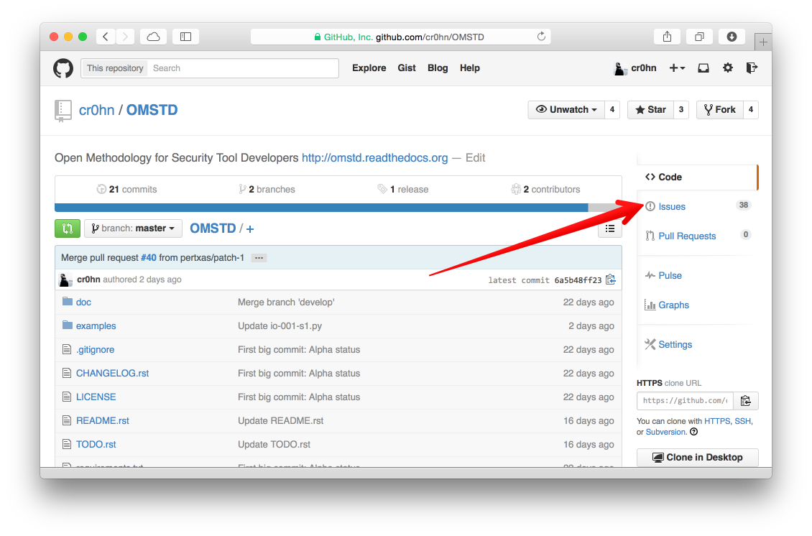
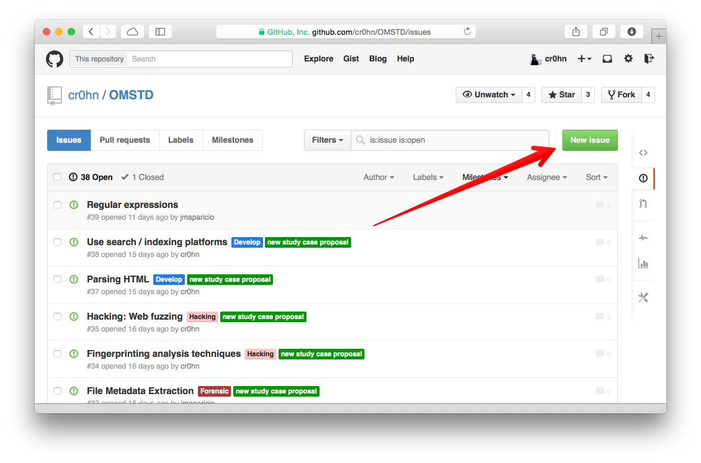
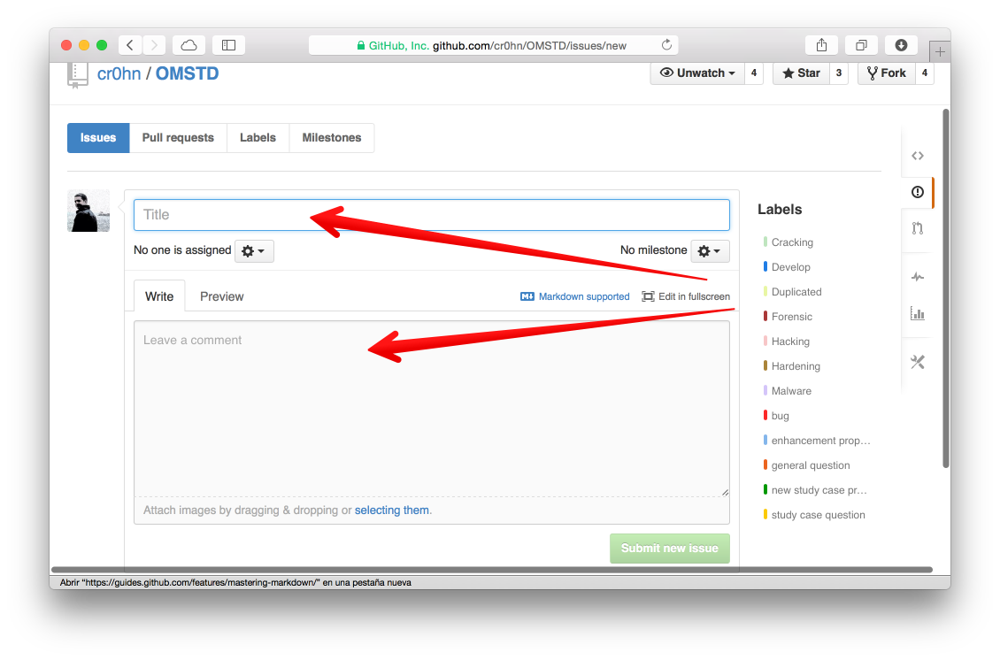
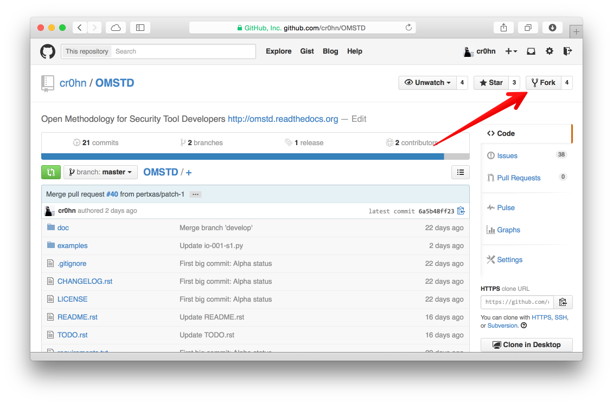

Cómo colaborar
==============

.. _contribute:

OMSTD es un proyecto de carácter abierto y gratuito. Si te apetece compartir tu experiencia y conocimiento con otros, serás muy bienvenido.

Principalmente existen los siguientes tipos de colaboraciones:

+ :ref:`Corrección de errores y mejoras <contrib_sec1>`:.
+ :ref:`Propuestas de nuevos casos de estudios <contrib_sec2>`.
+ :ref:`Envío de un nuevo caso de estudio <contrib_sec3>`.
+ :ref:`Ayuda a la traducción <contrib_sec4>`.

.. _contrib_sec1:

Corrección de errores y mejoras
-------------------------------

Si detectas cualquier **fallo** o algún punto mejorable puedes:

+ **Abrir un ticket** o incidencia y será tratado con la mayor brevedad posible (:ref:`Anexo 2 <annex_2_patch_github>`).
+ Enviar un parche que corrija dicho error (:ref:`Anexo 1 <annex_1_patch_github>`).

.. _contrib_sec2:

Propuestas de nuevos casos de estudios
--------------------------------------

Si deseas **sugerir un nuevo caso de estudio**, tan solo tienes que **abrir un ticket** con tu propuesta (:ref:`Anexo 2 <annex_2_patch_github>`).

Éste será clasificada y catalogada en función de la naturaleza del mismo.

.. _contrib_sec3:

Envío de un nuevo caso de estudio
---------------------------------

El medio **preferible** para enviar nuevos casos de estudio es el siguiente:

+ Crear un **fork** del proyecto (:ref:`Anexo 3 <annex_3_patch_github>`).
+ **Enviar un parche** con el nuevo caso de estudio (:ref:`Anexo 1 <annex_1_patch_github>`).

De esta forma todo quedará registrado, para que todo el mundo pueda seguirlo, además de llevar un mejor orden.

.. _contrib_sec4:

Ayuda a la traducción
---------------------

Este caso es muy parecido al anterior. pero con un cierto matiz:

+ Crear un **fork** del proyecto (:ref:`Anexo 3 <annex_3_patch_github>`).
+ **Copiar la carpeta** :samp:`doc/es` al directorio :samp:`doc/LANG`, donde *LANG* es el código ISO del lenguaje de la traducción. Por ejemplo: Si se está **traduciendo a inglés sería** :samp:`doc/en`. Sobre este directorio será sobre el que se trabajará y traducirá.
+ Enviar un parche con el nuevo caso de estudio (:ref:`Anexo 1 <annex_1_patch_github>`).

Anexos
------

.. _annex_1_patch_github:

Anexo 1: Envío de parches usando GitHub
+++++++++++++++++++++++++++++++++++++++

Una vez hemos *forkeado* y hechos los cambios pertinentes en el código, para enviar un parche siga las siguientes instrucciones:

1. Pulsamos en la opción de *Pull Request*:

2. Creamos un nueva nueva propuesta de parche pulsando en *New pull request*:

3. GitHub detectará los cambios realizados, extraídos de los commits que hayamos realizado, y preparará el request. Para finalizar el envío tan solo tenemos que pulsar en *Create pull request*:

.. _annex_2_patch_github:

Anexo 2: Apertura de incidencias en GitHub
++++++++++++++++++++++++++++++++++++++++++

La apertura de incidencias en GitHub es muy sencilla, tan solo tenemos que utilizar su sistema de ticketing:

1. Podemos ir directamente a los issues siguiendo el link https://github.com/cr0hn/OMSTD/issues, o podemos ir al home del proyecto, https://github.com/cr0hn/OMSTD, y pulsar en *Issues*, del menú de la derecha:

2. En esta pantalla nos aparecerán todas las incidencias y propuestas abiertas. Para crear una nueva pulsaremos en *New Issue*:

3. Para la apertura de la incidencia es necesario un título y una descripción. Es muy conveniente ser **conciso en el título** y **explicar en detalle** la incidencias, mejora o propuesta.

.. _annex_3_patch_github:

Anexo 3: Crear un fork de un proyecto en GitHub
+++++++++++++++++++++++++++++++++++++++++++++++

Crear un fork de un proyecto en GitHub es realmente fácil. Tan solo tendrás que:

#. Identificarte con tu usuario,
#. Ir al repositorio oficial del proyecto: https://github.com/cr0hn/OMSTD
#. Hacer *click* en el botón superior derecho con el texto *Fork*. La siguiente imagen muestra cómo:

