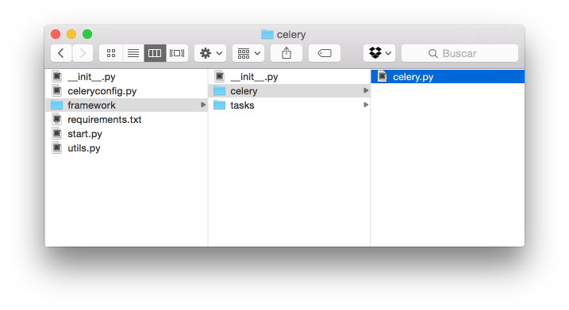

Comportamiento
==============

En este bloque se tratan los casos de estudio relacionados con la integración con las formas de comportarse el entorno y sus frameworks asociados.

.. _bh-001:

BH-001 - Procesamiento de tareas costosas
-----------------------------------------

Problema
********

No es fácil implementar un sistema de gestión y procesamiento de tareas en asíncronas o en background.

La finalidad de este tipo de tareas es poder realizar acciones de manera desatendida y, una vez finalizadas, informar de los resultados obtenidos.

**Ejemplo**:

    Tenemos un sitio web con un formulario de contacto. Este formulario envía un correo al administrador del sitio web.

    *Problema:*

    Si esperamos a que el mail sea enviado, estaremos haciendo esperar al usuario y **puede que este tiempo sea muy largo** (Sobre todo si el envío de mail falla y hay que tratar de reenviar).

Solución
********

Usar `Celery <http://www.celeryproject.org>`_. Celery es un gestor de tareas hecho en Python y que alcanza muy buenos niveles de rendimiento.

¿Cómo funciona?
+++++++++++++++

Celery está formado por 3 piezas principales:

* Un `broker <http://es.wikipedia.org/wiki/Bróker_de_mensajer%C3%ADa>`_.
* El servicio de Celery.
* La aplicación que interactúa con Celery, que será nuestra aplicación.

Esta animación puede que te ayude a comprender mejor su funcionamiento:

.. only:: html

    .. image:: ../../../images/bh-001.01.gif

.. only:: not html

    .. image:: ../../../images/bh-001.01.png

.. note::

    Aspectos importantes a tener en cuenta:

    * Posibles problemas de portabilidad: **Necesita un broker** .
    * Posible solución para portabilidad (¡**no para rendimiento**!): Usar `Django ORM <https://docs.djangoproject.com/en/dev/topics/db/>`_ + `SQLite <https://docs.djangoproject.com/en/dev/ref/settings/#databases>`_.

Cómo
****

Funcionamiento básico
+++++++++++++++++++++

Una forma de estructurar Celery es (¡puede haber más!):

.. note::

    Las carpetas deben de convertirse en paquetes, incluyendo un fichero :file:`__init__.py`, en caso contrario no será reconocido y cargado por Celery.

Como se puede ver la imagen anterior, tenemos las siguientes carpetas clave:

+ :file:`framework/`

  + :file:`framework/tasks/`: Contiene nuestro código. Es el que contendrá los ficheros con los fuentes de nuestras tareas que queramos ejecutar.
  + :file:`framework/celery/`: Contiene el único fichero `celery.py <https://github.com/cr0hn/OMSTD/blob/master/examples/develop/bh/001/framework/celery/celery.py>`_ con la información sobre cómo ha de ejecutarse Celery.

**Archivos importantes**:

    `framework/tasks/main_task.py <https://github.com/cr0hn/OMSTD/blob/master/examples/develop/bh/001/framework/tasks/main_task.py>`_

    Este fichero contiene un ejemplo de código que se ejecutará como parte de una tarea. Dicha tarea se quedará a la espera que se le mande información para procesar.

    En este ejemplo, cuando la tarea sea llamada, solamente mostrará un mensaje. Ésta es la forma más sencilla de crear tareas. Usando el decorador de Python :samp:`@celery.task` una función será convertida en una tarea.

    .. literalinclude:: ../../../../examples/develop/bh/001/framework/tasks/main_task.py
        :linenos:
        :lines: 22-
        :emphasize-lines: 3

    `framework/celery/celery.py <https://github.com/cr0hn/OMSTD/blob/master/examples/develop/bh/001/framework/celery/celery.py>`_

    Contiene la información necesaria para cargar y configurar Celery. A continuación se muestran la lineas más importantes de este fichero:

    .. literalinclude:: ../../../../examples/develop/bh/001/framework/celery/celery.py
        :linenos:
        :lines: 21-
        :emphasize-lines: 6,7,14

    `start.py <https://github.com/cr0hn/OMSTD/blob/master/examples/develop/bh/001/start.py>`_

    Contiene la llamada a la tarea tipo Celery.

    .. literalinclude:: ../../../../examples/develop/bh/001/start.py
        :lines: 25-
        :linenos:
        :emphasize-lines: 6

    .. note::

        En Celery, para llamar a una tarea de forma asíncrona, debemos de hacerlo como en el ejemplo. Aunque nuestro código sea una función, celery se encargará internamente de convertirla en un objeto con métodos.

        Las llamadas (o métodos) para llamar a la tarea son, `según el API oficial <http://celery.readthedocs.org/en/latest/userguide/calling.html>`_:

        + :samp:`my_task.delay(...)`
        + :samp:`my_task.apply_async(...)`

Funcionamiento avanzado
+++++++++++++++++++++++

**Configuración**:

    Por defecto, Celery solo importa las tareas que tienen como nombre de fichero :file:`tasks.py`. Usando un un pequeño truco, podemos localizar todos los ficheros con tareas de Celery, independientemente del nombre de fichero:

    `Ejemplo BH-001.P01 <https://github.com/cr0hn/OMSTD/blob/master/examples/develop/bh/001/utils.py>`_

    .. literalinclude:: ../../../../examples/develop/bh/001/utils.py
        :linenos:
        :lines: 25-
        :emphasize-lines: 2,4

    `Ejemplo BH-001.S02 <https://github.com/cr0hn/OMSTD/blob/master/examples/develop/bh/001/celeryconfig.py>`_

    .. literalinclude:: ../../../../examples/develop/bh/001/celeryconfig.py
        :linenos:
        :lines: 25-
        :emphasize-lines: 10

**Invocar tareas por su nombre:**

    Otra forma, algo más avanzada, de invocar una tarea de Celery (además de :samp:`my_task.delay()` y :samp:`my_task.apply_async()`) consiste en realizar una llamada usando el nombre relativo de la tarea, en lugar de usar código Python de programación.

    Veámoslo con un ejemplo:

    Supongamos que una tarea está situada en: :file:`framework.tasks.send_mails`, con el nombre de :samp:`send_mail()`. Conforme lo hemos visto hasta ahora la invocación sería como sigue:

    .. code-block:: python
        :linenos:
        :emphasize-lines: 4

        framework.tasks.send_mails import send_mail

        if __name__ == '__main__':
            send_mail.delay()

    Con este nuevo método quedría como sigue:

    .. code-block:: python
        :linenos:
        :emphasize-lines: 5,7

        from framework.celery.celery import celery

        if __name__ == '__main__':

            celery.send_task("framework.tasks.send_mails.send_mail")  # Without params

            celery.send_task("framework.tasks.send_mails.send_mail", ("From my@my.com"))  # With params

.. _bh-001-annex:

Anexo BH-001: Arrancar un entorno Celery
****************************************

Poner en funcionamiento un entorno que use Celery no es trivial. Han de arrancarse los servicios en el orden adecuado, esto es:

#. Arrancar el broker
#. Arrancar Celery
#. Arrancar nuestra aplicación

A continuación se explican los pasos a seguir para arrancar un entorno que funcione con Celery:

1 - Arrancar el broker
++++++++++++++++++++++

    Cada Broker tiene su propio método de arranque. En esta guía solo se cubrirá, de momento, `RabbitMQ <http://www.rabbitmq.com>`_:

    Para arrancar el servidor de RabbitMQ tenemos que escribir en una consola:

    .. code-block:: bash

        sudo rabbitmq-server &

    .. code-block:: console

                      RabbitMQ 3.1.5. Copyright (C) 2007-2013 GoPivotal, Inc.
          ##  ##      Licensed under the MPL.  See http://www.rabbitmq.com/
          ##  ##
          ##########  Logs: /opt/local/var/log/rabbitmq/rabbit@localhost.log
          ######  ##        /opt/local/var/log/rabbitmq/rabbit@localhost-sasl.log
          ##########
                      Starting broker... completed with 0 plugins.

.. _bh-001-annex-start-celery:

2 - Arrancar Celery
+++++++++++++++++++

    Celery es un software que corre como servicio, actuando de orquestador entre nuestra aplicación y el sistema de mensajería. Debemos arrancar una instancia de Celery por cada aplicación que queramos correr.

    La forma de arrancarlo está condicionada por la estructura de nuestro proyecto. La siguiente es una propuesta para de organización para nuestro código:

    .. code-block:: bash

        celery -A framework.celery.celery worker

    Si lo queremos con más información de depuración:

    .. code-block:: bash

        celery -A framework.celery.celery worker --loglevel=info

    .. code-block:: console

        [2014-11-03 16:35:54,223: WARNING/MainProcess] /Users/XXX/.virtualenvs/omstd/lib/python3.4/site-packages/celery/apps/worker.py:161: CDeprecationWarning:
        Starting from version 3.2 Celery will refuse to accept pickle by default.

        The pickle serializer is a security concern as it may give attackers
        the ability to execute any command.  It's important to secure
        your broker from unauthorized access when using pickle, so we think
        that enabling pickle should require a deliberate action and not be
        the default choice.

        If you depend on pickle then you should set a setting to disable this
        warning and to be sure that everything will continue working
        when you upgrade to Celery 3.2::

            CELERY_ACCEPT_CONTENT = ['pickle', 'json', 'msgpack', 'yaml']

        You must only enable the serializers that you will actually use.

          warnings.warn(CDeprecationWarning(W_PICKLE_DEPRECATED))

         -------------- celery@localhost v3.1.16 (Cipater)
        ---- **** -----
        --- * ***  * -- Darwin-14.0.0-x86_64-i386-64bit
        -- * - **** ---
        - ** ---------- [config]
        - ** ---------- .> app:         __main__:0x1085dba90
        - ** ---------- .> transport:   amqp://guest:**@localhost:5672//
        - ** ---------- .> results:     disabled
        - *** --- * --- .> concurrency: 4 (prefork)
        -- ******* ----
        --- ***** ----- [queues]
         -------------- .> celery           exchange=celery(direct) key=celery

        [tasks]
          . framework.tasks.export_results_task.export_to_csv
          . framework.tasks.yara_task.yara_task

        [2014-11-03 16:35:54,258: INFO/MainProcess] Connected to amqp://guest:**@127.0.0.1:5672//
        [2014-11-03 16:35:54,272: INFO/MainProcess] mingle: searching for neighbors
        [2014-11-03 16:35:55,297: INFO/MainProcess] mingle: all alone
        [2014-11-03 16:35:55,309: WARNING/MainProcess] celery@localhost ready.

3 - Lanzar nuestra aplicación
+++++++++++++++++++++++++++++

    Por último, lanzar nuestra aplicación será como ejecutar un script normal en Python:

    .. code-block:: bash

        python start.py

4 - Demo funcionamiento
+++++++++++++++++++++++

    A continuación se puede ver una pequeña demo de funcionamiento de Celery:

    .. only:: html

        .. raw:: html

            <iframe width="640" height="480" src="http://www.youtube.com/embed/bIGz5zkivB0" frameborder="0" allowfullscreen></iframe>

----

.. _bh-002:

BH-002 - Tareas programadas
---------------------------

Problema
********

La ejecución de forma programática o que se ejecuten cada *X* tiempo tiene los siguientes problemas (entre otros):

+ No es trivial de implementar.
+ No suele ser portable entre plataformas.
+ La implementación de métodos tradicionales abusa del uso de hilos o la suspensión del flujo de la ejecución de forma manual.

Solución
********

Celery Beat para ejecutar tareas programadas o temporizadas.

Cómo
****

Configuración
+++++++++++++

    Tan solo tenemos que cambiar la configuración de Celery y añadir la tarea que queremos ejecutar y la repetición del mismo:

    `Ejemplo BH-002.S01 <https://github.com/cr0hn/OMSTD/blob/master/examples/develop/bh/002/celeryconfig.py>`_

    .. literalinclude:: ../../../../examples/develop/bh/002/celeryconfig.py
        :lines: 26-
        :linenos:
        :emphasize-lines: 19-

Ejecución
+++++++++

    Para llamar a Celery Beat, tan solo tendremos que ejecutar Celery como se describió en la :ref:`sección anterior <bh-001-annex-start-celery>`, pero añadiendo el parámetro *-B*:

    .. code-block:: bash

        celery -A framework.celery.celery worker -B --loglevel=info