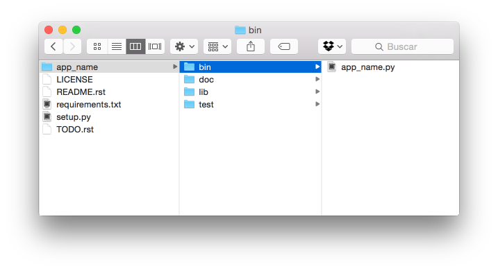
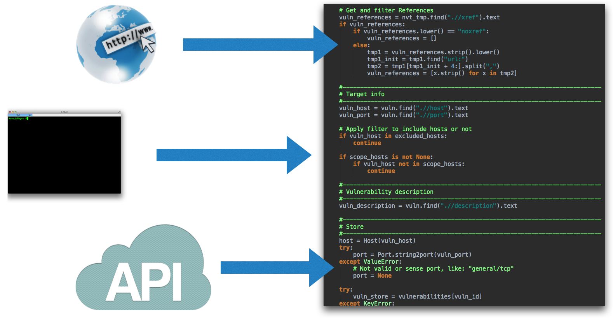
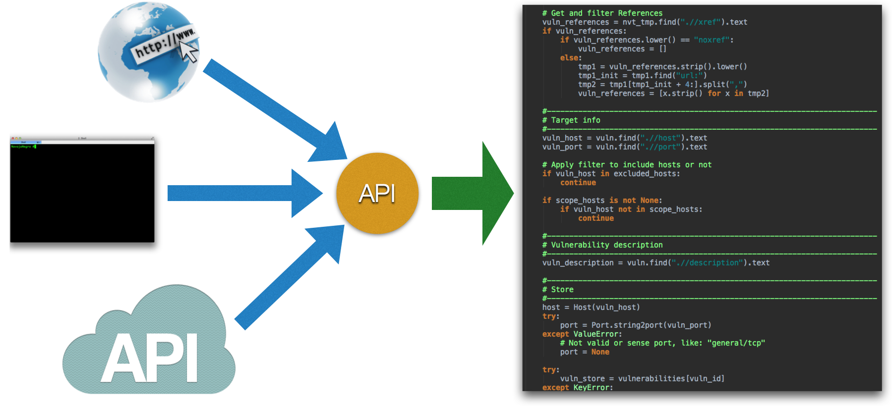
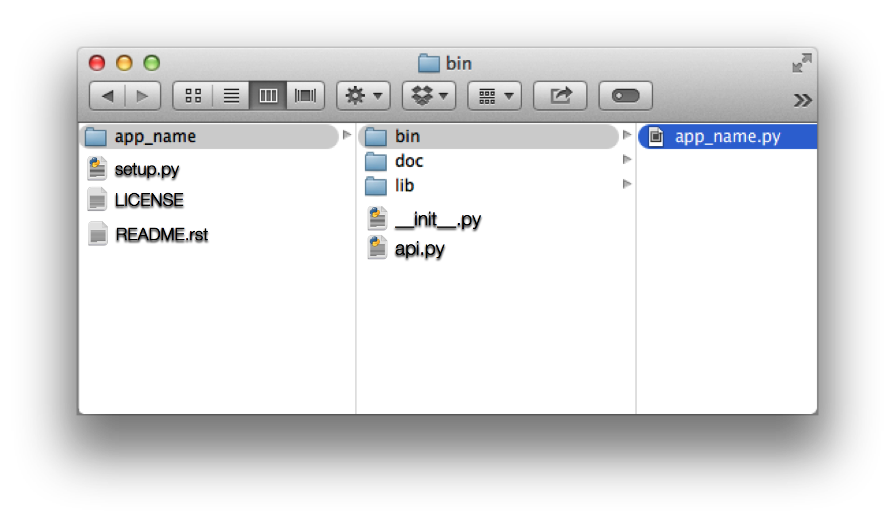

Organización y estructura
=========================

En este bloque se tratan los casos de estudio relacionados con la organización y estructura de proyectos.

----

.. _st-001:

ST-001 - Estructura de proyecto
-------------------------------

Problema
********

Muchas herramientas no contemplan la opción de ser usadas como librería (con un "import") además de por linea de comandos, o la interfaz que tengan definida.

Su uso puede ser complicado y, muchas veces, tan solo pueden ser usadas por linea de comandos, lo que implica llamar a un proceso externo del sistema y parsear su salida.

Solución
********

Una estructura correcta en la organización de archivos, pensada para ser re-utilizable.

Cómo
****

En la imagen se puede ver la estructura propuesta:

Donde:

+ **LICENCE**: Fichero de licencia. Contiene el texto legal con el que queremos redistribuir nuestro código.
+ **README.rst**: Fichero índice de documentación del proyecto. Será el primero en mostrarse y leerse por defecto.
+ **requirements.txt**: Contiene las dependencias de librerías externas de nuestro proyecto.
+ **setup.py**: Contiene información para la instalación, configuración y redistribución de nuestro software.
+ **TODO.rst**: Ideas futuras a implementar en nuestro proyecto. Es buena idea tenerlo por si alguien quiere colaborar con nuestro proyecto, ya que podrá encontrar tareas e ideas por hacer.
+ **app_name**: Carpeta, que actúa como paquete Python, con el nombre de nuestra aplicación.
+ **app_name/bin**: Ejecutables disponibles en nuestra aplicación.
+ **app_name/doc**: Archivos de documentación, usualmente escrita con `Shpinx <http://sphinx-doc.org>`_. Esta guía es un ejemplo de su uso.
+ **app_name/lib**: Librerías propias que genere nuestra aplicación.
+ **app_name/test**: Contiene los diferentes test de la aplicación: Unitarios, de integración, rendimiento...

----

.. _st-002:

ST-002 - Entrada de parámetros globales
---------------------------------------

Problema
********

Una vez preparada la estructura para nuestra aplicación, ahora queremos "llamar" o ejecutar el programa en cuestión. Problemas:

* Añadir nuevos parámetros de entrada al programa, requiere muchos cambios.
* El código se hace cada vez más enrevesado e inmanejable.
* Cambios de versiones de un mismos programas son incompatibles.

`Ejemplo ST-002.P01 <../../../../../examples/develop/st/002/st-002-p1.py>`_

Este ejemplo de programa que divide dos números. Acepta 2 parámetros por linea de comandos:

* Nominado
* Denominador

Si ocurre una división por 0 devuelve -1:

.. literalinclude:: ../../../../examples/develop/st/002/st-002-p1.py
    :lines: 25-
    :linenos:

`Ejemplo ST-002.P02 <../../../../../examples/develop/st/002/st-002-p2.py>`_

Ahora queremos añadir otro parámetro, "verbosity", como opción a nuestro programa.

Vemos que hay que modificar el código en 2 sitios diferentes. En todos aquellos donde se tenga que pasar información de las opciones de ejecución:

.. literalinclude:: ../../../../examples/develop/st/002/st-002-p2.py
    :lines: 25-
    :linenos:
    :emphasize-lines: 6,7,16

Solución
********

Hacer un objeto global que sea el que contenga los parámetros globales de ejecución (proyectos grandes, como nmap, proyecto lo hacen de esta forma):

Cómo
****

`Ejemplo ST-002.S01 <../../../../../examples/develop/st/002/st-002-s1.py>`_

.. literalinclude:: ../../../../examples/develop/st/002/st-002-s1.py
    :lines: 26-
    :linenos:
    :emphasize-lines: 2-9,31-35

----

.. _st-003:

ST-003 - Gestión de resultados
------------------------------

Problema
********

Recuperar la información de salida de una aplicación es muy complicado:

* No está estandarizada
* Hay que parsear muchos XML/JSON.
* La herramienta solo reporta resultados por consola.

Usando el mismo ejemplo que en el anterior caso:

`Ejemplo ST-003.P01 <../../../../../examples/develop/st/003/st-003-p1.py>`_

.. literalinclude:: ../../../../examples/develop/st/003/st-003-p1.py
    :lines: 25-
    :linenos:

Cuando queremos añadir un parámetro nuevo en la devolución, vemos que hay que modificar varias lineas de código:

`Ejemplo ST-003.P02 <../../../../../examples/develop/st/003/st-003-p2.py>`_

.. literalinclude:: ../../../../examples/develop/st/003/st-003-p2.py
    :lines: 26-
    :linenos:
    :emphasize-lines: 4-5,7,9,20,22

Solución
********

Usar objetos genéricos que contengan la información resultante de la ejecución del a herramienta.

Además, estos objetos, nos permiten abstraer el almacenamiento de información, de cómo ésta es exportada o transformada: XML, JSON, HTML, PDF ...

Cómo
****

`Ejemplo ST-003.S01 <../../../../../examples/develop/st/003/st-003-s1.py>`_

.. literalinclude:: ../../../../examples/develop/st/003/st-003-s1.py
    :lines: 26-
    :linenos:
    :emphasize-lines: 2-8,14-15,17-18,20,32,34

----

.. _st-004:

ST-004 - Unificar puntos de entrada
-----------------------------------

Problema
********

Tengo que cambiar mucho código y rehacer gran parte de mi aplicación, cada vez que quiero hacer una nueva UI (User Interface):

* Linea de comandos.
* Interfaz gráfica.
* Web.
* Que se use como librería.

Solución
********

Centralizar el punto de entrada a la ejecución de tu aplicación en un único punto y que todas las UI usen el mismo.

Cómo
****

Incluir el concepto de api.py y enseñar como el command line y el import funcionan igual.

`Ejemplo ST-004.P01 <../../../../../examples/develop/st/004/>`_

Tras incluir el fichero "api.py", la UI de linea de comandos (`st-004-s1.py <../../../../../examples/develop/st/004/st-004-s1.py>`_) nos quedará como sigue:

.. literalinclude:: ../../../../examples/develop/st/004/st-004-s1.py
    :lines: 26-
    :linenos:
    :emphasize-lines: 1,16

Si echamos un vistazo a `api.py <../../../../examples/develop/004/api.py>`_, podemos observar que este fichera centraliza las llamadas al resto de librerías:

.. literalinclude:: ../../../../examples/develop/st/004/api.py
    :lines: 28-
    :linenos:
    :emphasize-lines: 2,5-6
